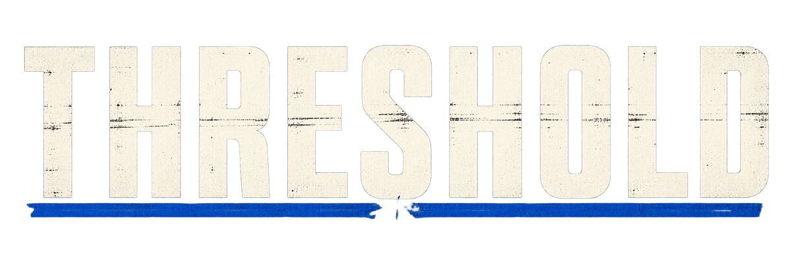
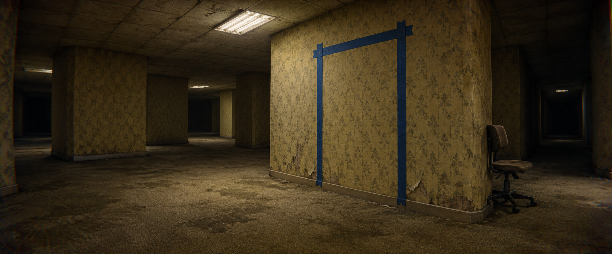
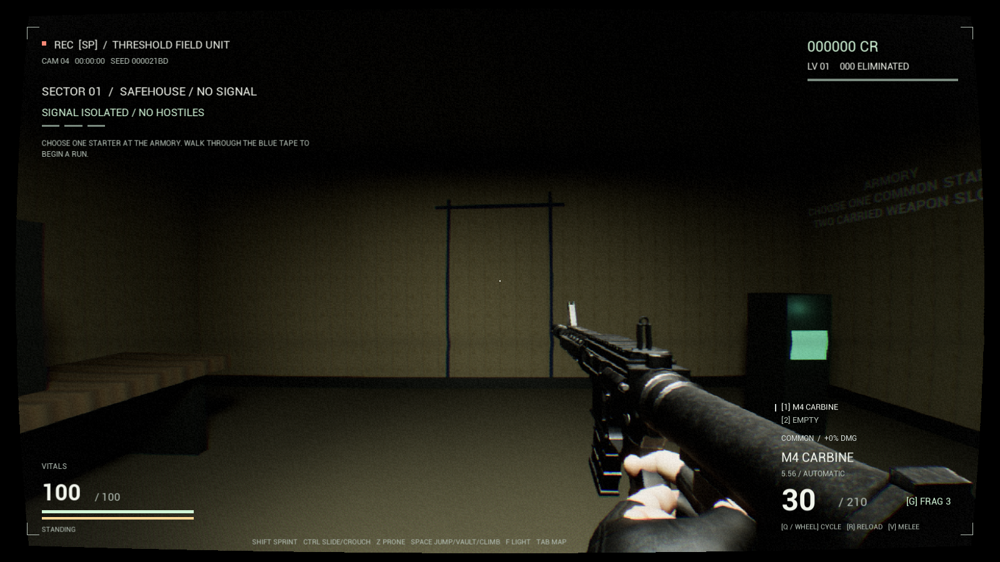

Cross the blue tape. THRESHOLD is a single-player Backrooms survival FPS roguelite: explore impossible rooms, fight for better weapons, unlock a refuge, and turn each run into permanent progression.

**[Download the compiled Windows x64 build](https://github.com/FennXWeb/Threshold/releases/latest)** · **SMOG repository: `FennXWeb/Threshold`**

## Install with SMOG

1. Add `FennXWeb/Threshold` in SMOG.
2. Select **threshold-1.0.0-windows-x64.zip** from the latest release, then Install.
3. Press Play. SMOG uses the included `smog_launch.bat` and tracks the running game.

This is a public repository; no GitHub token is needed. Future published releases can be installed through SMOG's update check.

For a manual install, download the release ZIP, extract the entire archive, and run **smog_launch.bat**. The automatic GitHub source ZIP contains publishing files only. Keep the complete runtime folder structure together.

## Inside the build

- Procedural Backrooms corridors connect six landmarks, hidden loot rooms and rare, enemy-free anomaly floors.
- Bodycam/VHS presentation, fast movement, sliding, prone, vaulting and climbing.
- Six guns, six rarity tiers and two inventory slots; pick up and swap physical weapon drops.
- Five animated entity types with ragdoll deaths.
- Three relays unlock a protected refuge for purchases, resupply and the next descent.
- 48 run upgrades and a rebirth archive with 96 skills, 403 ranks and eight active abilities.
- Dynamic room reverb, ElevenLabs effects and 110 recorded contextual survivor lines. Voice playback works offline.

See **[PLAY.md](PLAY.md)** for controls and save locations, **[CHANGELOG.md](CHANGELOG.md)** for the release, and **[CREDITS.md](CREDITS.md)** for asset attribution.

Actual packaged gameplay, captured during release verification.

## Compatibility and scope

Windows x64, a DirectX 12 capable graphics card and a current graphics driver are required. Windows 11 is the target platform. Visual C++ runtime DLLs are included beside the game executable. Storage required is recorded in [release-manifest.json](release-manifest.json).

Version 1.0.0 is the first SMOG distribution of the current **Unreal Engine 5.7.4 Development build**, compiled September 30, 2026. It is a playable development release with known rough edges; performance requirements have not been benchmarked. First-launch shader compilation can stutter. Weapon archetypes share the Bodycam arm animation set. Permanent progress is saved; active expeditions are not resumed after closing the game.

The header, logo and icon are AI-generated promotional artwork, not gameplay screenshots. Generated originals, prompts and export tooling are in [artwork](artwork) and [scripts](scripts). Community models and purchased content are distributed only inside the cooked game. This repository holds release documentation and SMOG assets, not the editable Unreal project.

THRESHOLD is an independent project and is not an official adaptation or affiliated with the creators of referenced films or games. Third-party content retains its respective licenses; no blanket open-source license is granted over the compiled game or its assets.

## Publishing files

The five root files follow the supplied [SMOG publishing contract](SMOG_PUBLISHING.md). The release ZIP contains byte-identical copies of all five. [RELEASE_CHECKS.md](RELEASE_CHECKS.md) records distribution validation; [SHA256SUMS.txt](SHA256SUMS.txt) identifies the downloadable ZIP.

`scripts/package_release.py` packages an existing compiled Windows directory with these files and app-local Microsoft runtime DLLs. `scripts/validate_release.py` checks metadata, artwork, ZIP safety, runtime hashes and launch structure. Neither script rebuilds Unreal or includes developer saves.
